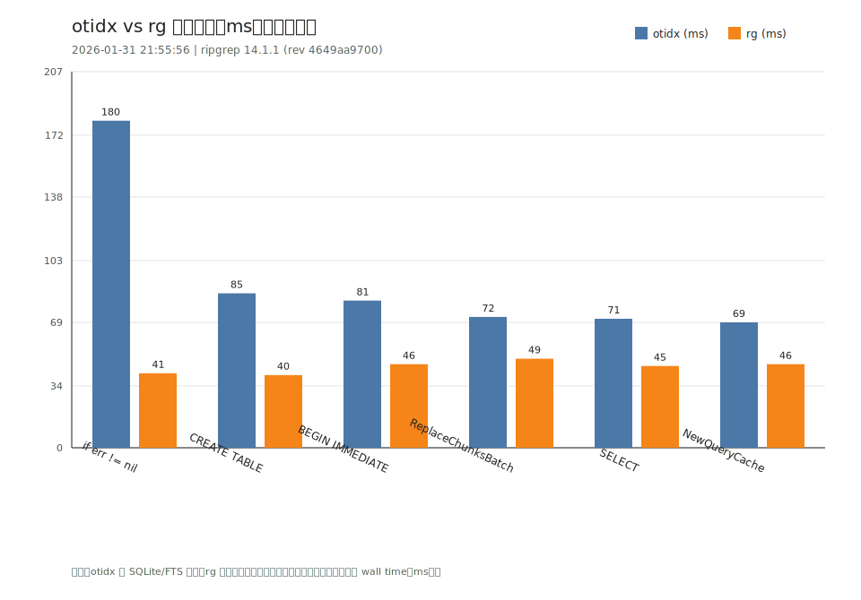

# OtterIndex（`otidx` / `otidxd`）

本项目提供一个 **本地** 的代码/文本索引与查询工具：

- `otidx`：命令行索引/查询（索引落到本地 SQLite）
- `otidxd`：daemon（TCP JSON-RPC：`ping`/`version`/`workspace.add`/`index.build`/`query`/`watch.*`）

> 设计目标：根据关键词，返回“尽可能小的上下文单元块”，并带上文件相对路径 + 行号信息，方便携带上下文做进一步处理。

---

## 安装与构建

要求：已安装 Go（版本以 `go.mod` 为准）。

在仓库根目录：

```powershell
# 直接运行（不产物）
go run ./cmd/otidx --help

# 构建二进制（Windows 示例）
go build -o otidx.exe ./cmd/otidx
go build -o otidxd.exe ./cmd/otidxd
```

### 可选：启用 tree-sitter（默认 `--unit symbol`）

tree-sitter 版需要在构建/运行时加 `-tags treesitter`，并且本机可用 CGO + gcc（Windows 推荐 MinGW）。
在 tree-sitter 版里，`q` 的默认 `--unit` 会自动变成 `symbol`（如果你更喜欢旧行为，可显式传 `--unit block`）。

```powershell
# 构建 treesitter 版（二选一：build 或 go run）
go build -tags treesitter -o otidx-ts.exe ./cmd/otidx

# 重新建索引（写入 symbols/comments；否则 --unit symbol 会自动降级）
.\otidx-ts.exe index build .

# 默认就是最小符号范围（可用 --unit block 退回旧行为）
.\otidx-ts.exe keyword --explain
```

Windows 下推荐直接跑：`pwsh -NoProfile -File scripts/test-treesitter.ps1`；常见 cgo/MinGW 问题排查见：`docs/cgo-windows-mingw.md`。

---

## 快速上手

### 1）在项目里建索引

```powershell
# 在当前目录（建议是你的 workspace 根）构建索引
go run ./cmd/otidx index build .
```

默认数据库路径为：`.otidx/index.db`（相对当前工作目录）。

### 2）关键词查询

```powershell
# 两种写法等价：
go run ./cmd/otidx q keyword
go run ./cmd/otidx keyword
```

默认输出：**多行“单元块”**（路径为相对路径），包含：

- `path:line:col (sl-el)`
- 带行号的代码/文本块（命中行用 `>` 标记）

如果你想要 grep 风格的**单行列表**：加 `--compact`；想要 vim 友好：加 `-L`；想要脚本/Agent：用 `--jsonl`。

---

## 为什么 OtterIndex（我们强在哪里）

- **更“贴近代码单元”**：不是只吐一行命中，而是给你一个可控的最小上下文单元块（`--unit line|block|file|symbol`），并带 `range {sl,el}` 方便继续取上下文。
- **定位信息完整**：默认输出 `path:line`，`-L` 输出 `path:line:col`，`--jsonl` 输出 `range`（行号范围）+ `matches`（命中位置）。
- **默认就输出“单元块”**：`otidx q "..."` 直接多行打印（更适合“查代码”）；想要快速浏览/脚本管线可以用 `--compact/-L/--jsonl`。
- **机器可读也不丢上下文**：`--jsonl --show` 会把单元块塞进 `text` 字段，方便直接喂给脚本/Agent。
- **索引一次，多次查询**：`index build` 把内容落到本地 SQLite（可用则启用 FTS5），后续 `q` 不再全量遍历文件树，查询更快。
- **过滤与忽略更符合工程习惯**：支持 `-g/-x/-A`，默认按 `.gitignore` 语义过滤，并跳过 `.git/node_modules/dist/target` 与隐藏文件。
- **对脚本/Agent 友好**：`--jsonl` 适合直接喂给脚本；`--explain/--viz ascii` 方便调试与可解释输出；`otidxd` 预留给 IDE/Agent 的 RPC 接入。

---

## 真实输出示例（在本仓库跑出来的）

> 注：下面示例的 workspace 路径是 `D:\xyad\codegrep`，换机器会不同；但相对路径/行号/输出格式一致。

### 1）构建索引（带调试信息）

`--explain` 与 `--viz` 写入 stderr。

```powershell
> .\.otidx\bin\otidx.exe index build . --explain --viz ascii 2>&1
pipeline:

  walk   ->  index   ->  query   ->  unitize  ->  render
explain:
  action: index build
  root: D:\xyad\codegrep
  db: .otidx\index.db
  fts: true
  chunks: 273
```

### 2）默认查询输出（多行单元块）

```powershell
> .\.otidx\bin\otidx.exe maybePrintViz | Select-Object -First 19
internal/otidxcli/explain.go:10:6 (10-26)
> 10| func maybePrintViz(cmd *cobra.Command) {
  11| 	if cmd == nil {
  12| 		return
  13| 	}
  14| 	opts := optionsFrom(cmd)
  15| 	if opts == nil {
  16| 		return
  17| 	}
  18| 	if opts.Viz == "" {
  19| 		return
  20| 	}
  21| 
  22| 	switch opts.Viz {
  23| 	case "ascii":
  24| 		_, _ = fmt.Fprint(cmd.ErrOrStderr(), VizASCII())
  25| 	}
  26| }
```

### 3）单行列表（grep 风格）

```powershell
> .\.otidx\bin\otidx.exe maybePrintViz --compact
internal/otidxcli/explain.go:10: func maybePrintViz(cmd *cobra.Command) {
internal/otidxcli/index_cmd.go:30: maybePrintViz(cmd)
internal/otidxcli/q_cmd.go:24: maybePrintViz(cmd)
internal/otidxcli/root.go:33: maybePrintViz(cmd)
```

### 4）Vim 友好输出（path:line:col: snippet）

```powershell
> .\.otidx\bin\otidx.exe maybePrintViz -L
internal/otidxcli/explain.go:10:6: func maybePrintViz(cmd *cobra.Command) {
internal/otidxcli/index_cmd.go:30:4: maybePrintViz(cmd)
internal/otidxcli/q_cmd.go:24:4: maybePrintViz(cmd)
internal/otidxcli/root.go:33:5: maybePrintViz(cmd)
```

### 5）JSONL 输出（带 range + 可选 text）

`--unit line -c 2`：返回命中行上下 2 行的范围（`sl..el`）。

```powershell
> .\.otidx\bin\otidx.exe maybePrintViz --jsonl --unit line -c 2 | Select-Object -First 1
{"kind":"unit","path":"internal/otidxcli/explain.go","range":{"sl":8,"sc":1,"el":12,"ec":1},"snippet":"func maybePrintViz(cmd *cobra.Command) {","matches":[{"line":10,"col":6,"text":"func maybePrintViz(cmd *cobra.Command) {"}]}
```

加上 `--show` 会把单元块内容写入 JSON 的 `text` 字段：

```powershell
> .\.otidx\bin\otidx.exe maybePrintViz --jsonl --show --unit line -c 2 | Select-Object -First 1
{"kind":"unit","path":"internal/otidxcli/explain.go","range":{"sl":8,"sc":1,"el":12,"ec":1},"snippet":"func maybePrintViz(cmd *cobra.Command) {","text":")\n\nfunc maybePrintViz(cmd *cobra.Command) {\n\tif cmd == nil {\n\t\treturn","matches":[{"line":10,"col":6,"text":"func maybePrintViz(cmd *cobra.Command) {"}]}
```

拿到 `path + range.sl/range.el` 后，你也可以在本地直接取出对应代码块：

```powershell
# 示例：取出 internal/otidxcli/explain.go 的 8..12 行
Get-Content -LiteralPath .\internal\otidxcli\explain.go |
  Select-Object -Skip 7 -First 5
```

---

## 性能（实测）

> 实测环境：在本仓库（`chunks: 273`、`fts: true`）用已构建的 `otidx.exe` 运行（不是 `go run`）。不同机器/仓库规模会有差异。

- 构建索引：约 `227ms`（`otidx index build .`）
- 执行一次查询：约 `84ms`（`otidx q "maybePrintViz"`）

### 性能对比（otidx vs rg）

> 说明：下面图表来自 `bench/bench-vs-rg.ps1` 的输出，按多个 query case 做 **otidx（索引查询）** vs **rg（直接扫文件）** 的耗时对比（毫秒，越低越快）。结果会随机器/磁盘/仓库规模变化。



生成/更新方式（在仓库根目录）：

```powershell
pwsh -NoProfile -ExecutionPolicy Bypass -File .\bench\bench-vs-rg.ps1 -Rebuild -Limit 20 -Repeat 3
python .\bench\plot_bench_svg.py --out .\bench\docs\bench-vs-rg.svg
```

外部项目（Java/Vue/Python/C++）对比见：`bench/docs/external-projects.md`（会生成对应 SVG：`bench/docs/external-projects-vs-rg.svg`）。

```powershell
pwsh -NoProfile -ExecutionPolicy Bypass -File .\bench\bench-external-projects.ps1 -Limit 20 -Repeat 3
```

## 常用参数（对齐 mgrep 风格）

### 数据库

- `-d <dbname|path>`：指定数据库。
  - 如果传的是 **dbname**（不含 `/\:`），会自动落到 `.otidx/<dbname>.db`  
    例：`-d demo` → `.otidx/demo.db`
  - 如果传的是路径（如 `D:\x\y.db` 或 `./x/y.db`），则直接使用该路径
- `-l`：列出当前目录下 `.otidx/*.db`

### 扫描/过滤（用于 `index build`；也会用于 `q` 的结果二次过滤）

- `-A`：扫描 ALL（不跳过隐藏文件/默认目录；不使用 `.gitignore` 过滤）
- `-g <glob>`：只包含这些文件（可重复）
  - 例：`-g "*.go" -g "docs/*.md"`
- `-x <glob>`：排除这些文件（支持逗号分隔或重复）
  - 例：`-x "*.js,*.sql"` 或 `-x "*.js" -x "*.sql"`

忽略规则（默认）：

- 使用 `.gitignore`（语义由 go-git 实现，含嵌套 `.gitignore`）
- 默认跳过目录：`.git` / `node_modules` / `dist` / `target`
- 默认跳过隐藏文件（以 `.` 开头）

### 查询

- 查询命令：`otidx q <query...>`；也可以省略 `q`：`otidx <query...>`（更像 `rg`）
  - 如果你的 query 恰好是子命令名（如 `index/help/completion`），会优先进入子命令；此时请用显式写法：`otidx q index`
  - query 支持多个词：`otidx foo bar`（内部会用空格拼起来）；需要保留空格/特殊字符时请加引号
  - 如果 query 以 `-` 开头，请用 `--` 终止 flags：`otidx -- -foo`
- `-i`：大小写不敏感（用于文本定位/LIKE 回退等）
- `--unit <line|block|file|symbol>`：返回力度（默认：非 treesitter 版为 `block`；treesitter 版为 `symbol`）
  - `block`：返回索引 chunk 的行号范围（目前 chunk 默认按 40 行切分）
  - `line`：返回命中行上下文（受 `-c` 影响）
  - `file`：返回整文件范围（如果能拿到 workspace root 则计算到 EOF）
  - `symbol`：返回命中点所在的最小符号范围（tree-sitter；需要 `-tags treesitter` + CGO；无数据/不支持则自动降级为 `block`，见 `--explain` 的 `symbol_fallback/unit_fallback`）
- `-c <num>`：上下文行数（默认 1；仅 `--unit line` 生效）

### 输出

- `-L`：vim 友好行：`path:line:col: snippet`
- `--jsonl`：每行一个 JSON（包含 `range {sl,sc,el,ec}`，适合脚本/agent）
- `--compact`：单行输出（`path:line: snippet`），便于快速扫一眼/管线处理
- `--show`：与 `--jsonl` 搭配时，把单元块文本写入 `text` 字段（默认人读输出已是多行单元块）
- `--explain`：在 stderr 输出执行信息（db、过滤条件、命中数、unit 决策等）
- `--viz ascii`：在 stderr 打印固定的 ASCII 管线图（调试）

> `-B/-b/-z/-Z` 目前作为预留参数：用于将来 banner/主题/颜色相关输出（当前版本暂未做彩色渲染）。

---

## 示例

### 只查 Go 文件，返回命中行上下文

```powershell
go run ./cmd/otidx NewRootCommand --unit line -c 2 -g "*.go"
```

### 输出 JSONL（带 range）

```powershell
go run ./cmd/otidx sqlite --jsonl
```

### 调试：查看 explain + 管线图

```powershell
go run ./cmd/otidx q index --explain --viz ascii
```

---

## `otidxd`（daemon）最小用法

启动：

```powershell
go run ./cmd/otidxd -listen 127.0.0.1:7337
```

协议：TCP JSON-RPC 2.0，一条请求一行 JSON（服务端按 JSON 解码）。

方法列表：

- `ping` / `version`
- `workspace.add`（`root`，可选 `db_path`）
- `index.build`（`workspace_id`，可选 `scan_all/include_globs/exclude_globs`），返回 `version`
- `query`（`workspace_id/q` 必填，`unit/limit/offset/context_lines/case_insensitive/include_globs/exclude_globs/show` 可选）
  - 默认：`unit=block`，`limit=20`，`offset=0`，`context_lines=0`，`show=false`
  - `show=true` 会附加 `ResultItem.text`
- `watch.start` / `watch.stop` / `watch.status`（`workspace_id` 必填，可选 `scan_all/include_globs/exclude_globs/sync_on_start/debounce_ms/sync_workers`）
  - 返回 `{ "running": true|false }`
  - `sync_on_start=true` 会在启动时做一次“全目录遍历 + 仅更新变更文件”的补扫（默认并发为 CPU 核心数的一半）
  - `debounce_ms` 控制 watcher 防抖延迟（默认 200ms）
  - `sync_workers` 控制补扫并发数（默认 CPU 核心数的一半）

示例请求/响应：

```json
{"jsonrpc":"2.0","method":"ping","id":1}
{"jsonrpc":"2.0","method":"version","id":2}
{"jsonrpc":"2.0","method":"workspace.add","id":3,"params":{"root":"."}}
{"jsonrpc":"2.0","method":"index.build","id":4,"params":{"workspace_id":"<wsid>"}}
{"jsonrpc":"2.0","method":"query","id":5,"params":{"workspace_id":"<wsid>","q":"hello","unit":"block","limit":10,"offset":0,"show":true}}
```

```json
{"jsonrpc":"2.0","id":1,"result":"pong"}
{"jsonrpc":"2.0","id":2,"result":"0.1.0"}
{"jsonrpc":"2.0","id":3,"result":"<wsid>"}
{"jsonrpc":"2.0","id":4,"result":1}
{"jsonrpc":"2.0","id":5,"result":[{"path":"a.go","range":{"sl":1,"sc":1,"el":2,"ec":1},"snippet":"hello","text":"hello\nworld"}]}
```

---

## 说明与限制（MVP）

- 需要先 `otidx index build` 生成 SQLite 索引；目前不做增量更新/监听，文件变更后建议重建索引。
- SQLite FTS5 **默认尝试启用**；如果当前 SQLite 构建不支持 FTS5（或创建虚表失败）会自动回退到 `LIKE`（速度较慢但可用，可用 `--explain` 查看 `fts5/fts5_reason`）。
- “最小代码单元块”用 `--unit` 控制（`line/block/file/symbol`）。
  - `symbol` 依赖 tree-sitter：需要以 `-tags treesitter` 构建/运行，并且启用 CGO。
  - 当前已接入：Go/Java/Python/JavaScript/TypeScript/TSX/C/C++/PHP/C#/JSON/Bash；其他文件类型会自动降级为 `block`（`--explain` 里会标注 `symbol_fallback/unit_fallback`）。
