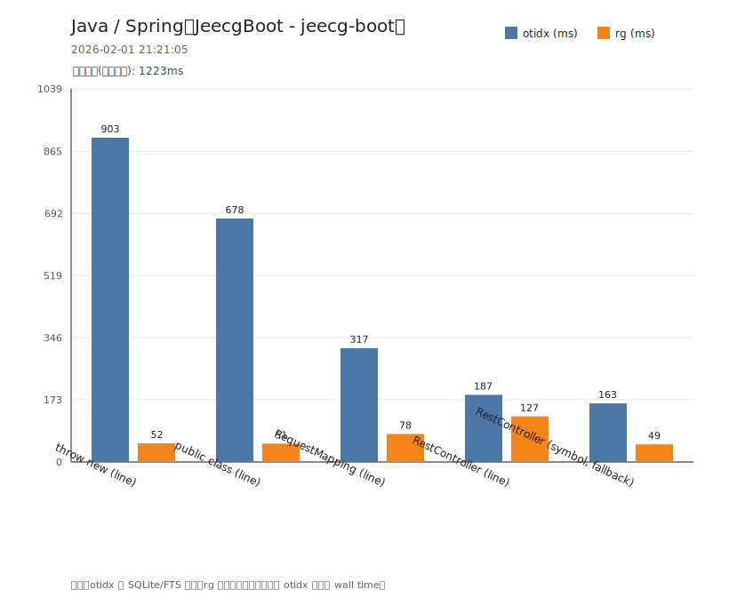
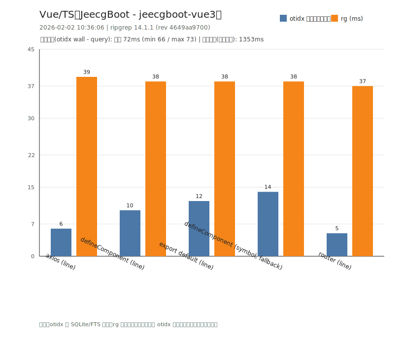
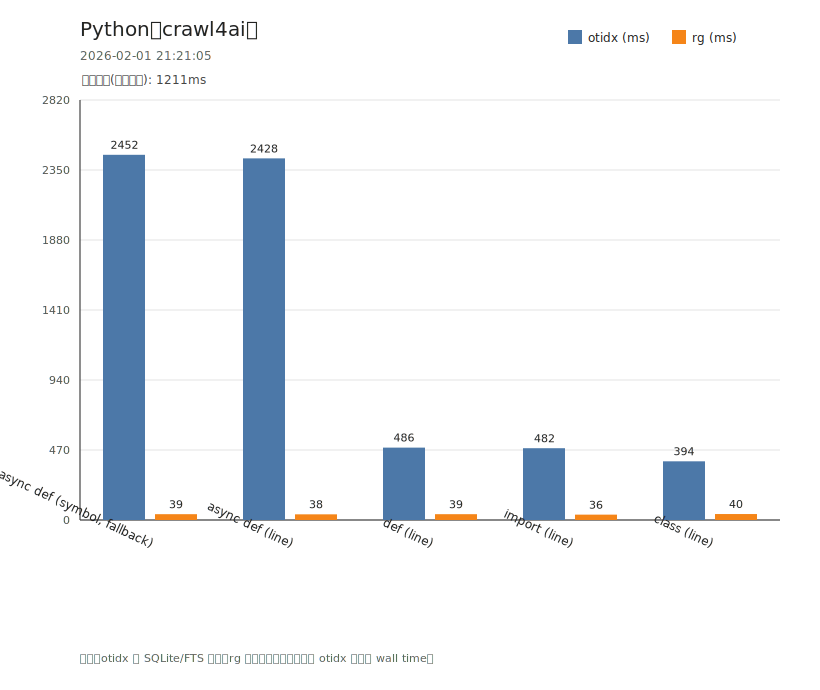
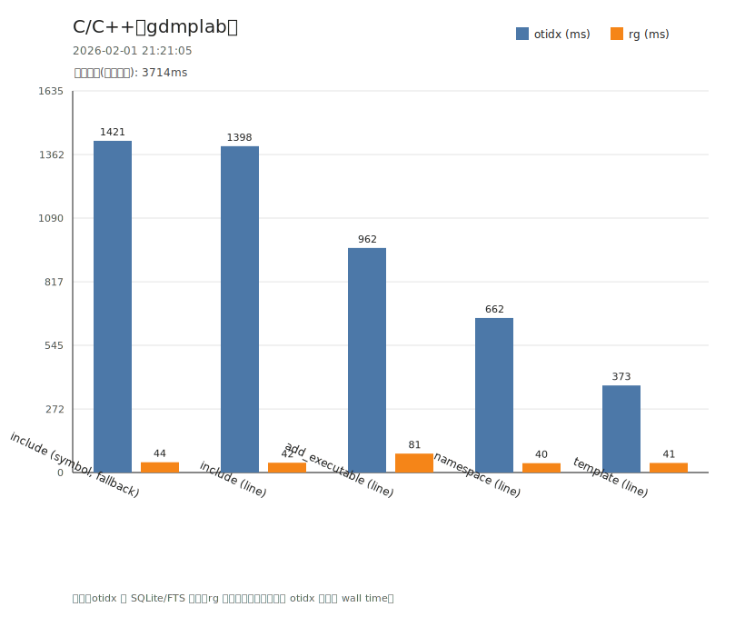

# 外部项目基准测试（otidx vs rg）

更新时间：2026-01-31 22:48:17

说明：
- otidx 走 SQLite/FTS 索引；rg 为直接扫描文件。
- 数值为脚本取多次运行中的最小 wall time（ms）。repeat=3，limit=20。
- 图表内 otidx 使用“查询耗时（wall - 加载）”；加载时间（索引构建）在图表顶部单独标注。
- 当前 tree-sitter 只接入 Go；非 Go 工程里 `--unit symbol` 会自动降级（fallback）。

## Java / Spring（JeecgBoot - jeecg-boot）

- root: `D:\project\JeecgBoot\jeecg-boot`
- db: `.otidx/ext/java-jeecg-boot.db`
- include globs: `*.java, *.xml, *.yml, *.yaml, *.properties`
- index.build: `1223ms`（files_total=981 files_indexed=981 chunks_written=3381 symbols_written=0 treesitter_unsupported=981 fts5=True）

| case | unit | globs | otidx(ms) | rg(ms) | 说明 |
|---|---|---|---:|---:|---|
| RestController (line) | line | *.java | 187 | 127 |  |
| RequestMapping (line) | line | *.java | 317 | 78 |  |
| public class (line) | line | *.java | 678 | 51 |  |
| throw new (line) | line | *.java | 903 | 52 |  |
| RestController (symbol, fallback) | symbol | *.java | 163 | 49 | symbol_fallback; unit_fallback=symbol->block |

## Vue/TS（JeecgBoot - jeecgboot-vue3）

- root: `D:\project\JeecgBoot\jeecgboot-vue3`
- db: `.otidx/ext/vue-jeecgboot-vue3.db`
- include globs: `*.vue, *.ts, *.tsx, *.js, *.jsx, *.css, *.scss, *.json`
- index.build: `1504ms`（files_total=1383 files_indexed=1383 chunks_written=5050 symbols_written=0 treesitter_unsupported=1383 fts5=True）

| case | unit | globs | otidx(ms) | rg(ms) | 说明 |
|---|---|---|---:|---:|---|
| defineComponent (line) | line | *.vue, *.ts, *.tsx | 590 | 47 |  |
| export default (line) | line | *.vue, *.ts, *.tsx, *.js, *.jsx | 1686 | 42 |  |
| axios (line) | line | *.vue, *.ts, *.tsx, *.js, *.jsx | 347 | 56 |  |
| router (line) | line | *.vue, *.ts, *.tsx, *.js, *.jsx | 436 | 46 |  |
| defineComponent (symbol, fallback) | symbol | *.vue, *.ts, *.tsx | 587 | 56 | symbol_fallback; unit_fallback=symbol->block |

## Python（crawl4ai）

- root: `D:\project\crawl4ai`
- db: `.otidx/ext/python-crawl4ai.db`
- include globs: `*.py, *.toml, *.yml, *.yaml, *.md`
- index.build: `1211ms`（files_total=482 files_indexed=482 chunks_written=4549 symbols_written=0 treesitter_unsupported=482 fts5=True）

| case | unit | globs | otidx(ms) | rg(ms) | 说明 |
|---|---|---|---:|---:|---|
| async def (line) | line | *.py | 2428 | 38 |  |
| def (line) | line | *.py | 486 | 39 |  |
| class (line) | line | *.py | 394 | 40 |  |
| import (line) | line | *.py | 482 | 36 |  |
| async def (symbol, fallback) | symbol | *.py | 2452 | 39 | symbol_fallback; unit_fallback=symbol->block |

## C/C++（gdmplab）

- root: `D:\project\gdmplab`
- db: `.otidx/ext/cpp-gdmplab.db`
- include globs: `*.c, *.cc, *.cpp, *.cxx, *.h, *.hpp, CMakeLists.txt, *.cmake`
- index.build: `3714ms`（files_total=3569 files_indexed=3569 chunks_written=12690 symbols_written=0 treesitter_unsupported=3569 fts5=True）

| case | unit | globs | otidx(ms) | rg(ms) | 说明 |
|---|---|---|---:|---:|---|
| include (line) | line | *.c, *.cc, *.cpp, *.cxx, *.h, *.hpp | 1398 | 42 |  |
| namespace (line) | line | *.c, *.cc, *.cpp, *.cxx, *.h, *.hpp | 662 | 40 |  |
| template (line) | line | *.c, *.cc, *.cpp, *.cxx, *.h, *.hpp | 373 | 41 |  |
| add_executable (line) | line | CMakeLists.txt, *.cmake | 962 | 81 |  |
| include (symbol, fallback) | symbol | *.c, *.cc, *.cpp, *.cxx, *.h, *.hpp | 1421 | 44 | symbol_fallback; unit_fallback=symbol->block |

---

原始数据：`result-2026-01-31-224816.txt`

