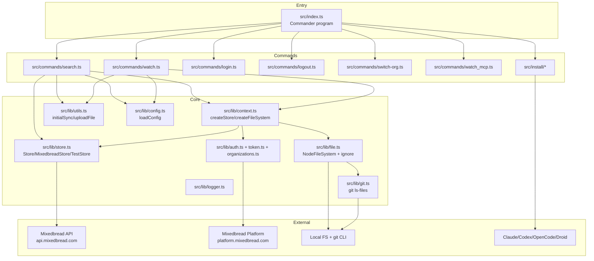

# mgrep 仓库深度走读报告

- 仓库路径：`D:\project\mgrep`
- 分支：`main`
- Commit：`fe2c523686e9a98a983660d0aa253ffdc097faf7`
- 走读日期：`2026-01-31`
- 目标读者：新接手的开发者 / 维护者 / AI coding agent

## TL;DR（一句话）

`mgrep` 是一个基于 Mixedbread 云端 Store 的语义搜索 CLI：`watch` 负责把本地文件同步到 Store，`search`/默认命令负责在本地 Store（可选叠加 `mixedbread/web`）里做检索与问答，并把结果格式化成“文件路径 + 行号范围/页码”的终端输出。

## 快速指标（便于快速建立直觉）

- 语言：TypeScript（Node ESM）为主；少量 Python（Claude/Factory Droid hooks）；Bats（Bash）做集成测试
- 规模：`src/` 约 23 个 TS 文件、约 3866 行（仅 `src/**/*.ts`）；`test/test.bats` 约 507 行
- CLI 框架：`commander`（入口 `src/index.ts`）
- 关键依赖：
  - Mixedbread：`@mixedbread/sdk`（Store 搜索/问答/文件上传）见 `src/lib/store.ts:150`
  - 认证：`better-auth`（device flow + org）见 `src/lib/auth.ts:13`、`src/lib/token.ts:11`
  - 索引：`ignore`（gitignore 语义）、`xxhash-wasm`、`p-limit` 见 `src/lib/file.ts:53`、`src/lib/utils.ts:87`、`src/lib/utils.ts:335`
- 关键外部边界（网络）：
  - Mixedbread API：`https://api.mixedbread.com`（`src/lib/context.ts:12`）
  - Mixedbread 平台：`https://www.platform.mixedbread.com`（`src/lib/auth.ts:9`）

---

## 目录

- [01. 项目概览](#01-项目概览)
- [02. 架构地图（分层 + 核心对象 + 数据流）](#02-架构地图分层--核心对象--数据流)
- [03. 入口与执行流程（Entrypoint → Critical Path）](#03-入口与执行流程entrypoint--critical-path)
- [04. 核心模块深挖（高杠杆子系统）](#04-核心模块深挖高杠杆子系统)
- [05. 上手实操（本地跑起来）](#05-上手实操本地跑起来)
- [06. 二次开发指南（可操作清单）](#06-二次开发指南可操作清单)
- [07. 仓库文档总结](#07-仓库文档总结)
- [08. 评分（100 分制，多维度）](#08-评分100-分制多维度)
- [09. 附录：关键文件/符号速查](#09-附录关键文件符号速查)

---

## 01. 项目概览

### 1.1 仓库定位

- 这是一个发布到 npm 的 CLI 包（`package.json:2`、`package.json:15`），二进制名为 `mgrep`，入口为构建产物 `dist/index.js`（`package.json:15`）
- 运行形态：Node.js ESM（`package.json:4`），TypeScript 编译目标 `ES2022`，模块解析 `NodeNext`（`tsconfig.json`）
- 核心能力：
  - `mgrep watch`：扫描 + 同步（上传/删除）本地文件到 Mixedbread Store，并持续监听变更（`src/commands/watch.ts:190`、`src/commands/watch.ts:142`）
  - `mgrep search`（也是默认命令）：在 Store 中做语义检索，支持 `--answer`（问答）、`--web`（叠加 `mixedbread/web` Store）、`--sync`（先同步再搜）（`src/commands/search.ts:193`、`src/index.ts:40`）
  - 多 agent 集成：Claude Code / Codex / OpenCode / Factory Droid（`src/index.ts:42`-`src/index.ts:49`）

### 1.2 关键目录与边界

- `src/index.ts`：CLI 装配点（注册命令、全局参数、logger）见 `src/index.ts:24`、`src/index.ts:40`
- `src/commands/`：子命令实现（`search/watch/login/logout/switch-org/mcp`）
- `src/lib/`：核心逻辑（认证、配置、文件扫描与 ignore、同步、Store 抽象、日志）
- `src/install/`：面向各类 coding agent 的安装器（写入外部配置/安装插件）
- `plugins/`：Claude/Factory Droid 插件资产（hooks、skill）
- `test/`：bats 集成测试（使用本地 `TestStore`，不依赖网络）
- `.github/workflows/`：CI + 发布流程

---

## 02. 架构地图（分层 + 核心对象 + 数据流）

### 2.1 模块清单（按层）

- **Entry / CLI 装配**
  - `src/index.ts`：`program.addCommand(search, { isDefault: true })`（`src/index.ts:40`）
- **Commands（用户动作）**
  - `src/commands/search.ts`：检索/问答 + 可选同步（`src/commands/search.ts:193`、`src/commands/search.ts:263`）
  - `src/commands/watch.ts`：初次同步 + fs.watch 增量同步（`src/commands/watch.ts:27`、`src/commands/watch.ts:142`）
  - `src/commands/login.ts` / `logout.ts` / `switch-org.ts`：device 登录、注销、切组织
  - `src/commands/watch_mcp.ts`：MCP server（目前 tools 为空 + “Not implemented” 占位）见 `src/commands/watch_mcp.ts:64`、`src/commands/watch_mcp.ts:70`
- **Core（可复用核心能力）**
  - `src/lib/context.ts`：工厂（`createStore/createFileSystem/createGit`）见 `src/lib/context.ts:20`
  - `src/lib/store.ts`：Store 抽象（`Store` interface、`MixedbreadStore`、`TestStore`）见 `src/lib/store.ts:150`、`src/lib/store.ts:296`
  - `src/lib/utils.ts`：同步核心（hash/mtime、并发上传、删除、额度错误处理等）见 `src/lib/utils.ts:278`
  - `src/lib/file.ts` + `src/lib/git.ts`：文件枚举 + ignore 语义（git ls-files、`.gitignore`/`.mgrepignore`）见 `src/lib/file.ts:53`、`src/lib/git.ts:147`
  - `src/lib/config.ts`：配置加载（CLI/env/YAML precedence）见 `src/lib/config.ts:142`
  - `src/lib/logger.ts`：winston 文件日志（会覆写 `console.*`）见 `src/lib/logger.ts`
- **Ext / Integrations（面向 agent 的扩展）**
  - `src/install/*`：对外部工具写配置、装插件
  - `plugins/mgrep/*`：Claude/Factory Droid hooks & skill

### 2.2 Mermaid：模块依赖图（组件级）



---

## 03. 入口与执行流程（Entrypoint → Critical Path）

本节选取 2 条“最重要的用户路径”作为锚点：

- **锚点 A：`mgrep search`（默认命令）**：从 `src/index.ts` 进入，追到 `store.search/store.ask` 的关键调用链。
- **锚点 B：`mgrep watch`**：从初次同步到 fs.watch 增量上传/删除。

### 3.1 锚点 A：`mgrep search` / `mgrep "<query>" [path]`

#### 初始化与装配

1. CLI 启动后调用 `setupLogger()`（`src/index.ts:24`），可能将日志写入本机日志目录并覆写 `console.*`（`src/lib/logger.ts`）。
2. 通过 Commander 注册全局 `--store`（默认 `MXBAI_STORE || "mgrep"`，见 `src/index.ts:35`）与各子命令（`src/index.ts:40`-`src/index.ts:53`）。
3. `search` 被设置为默认命令：`program.addCommand(search, { isDefault: true })`（`src/index.ts:40`）。

#### 关键链路（逐步）

1. Commander 进入 `search` 的 `.action(...)`（`src/commands/search.ts:263`），读取 `cmd.optsWithGlobals()`（`src/commands/search.ts:276`）。
2. 计算 `search_path`：如果传了 `[path]` 则以 `process.cwd()` 为根做 join/normalize（`src/commands/search.ts` action 内）。
3. 读取配置：`loadConfig(root, cliOptions)`（`src/lib/config.ts:142`），配置来源与优先级也在 README 写明（`README.md:257` 起）。
4. 如启用 `--sync`，先走一次同步：
   - 创建 Store：`createStore()`（`src/lib/context.ts:20`）
   - 创建文件系统：`createFileSystem({ ignorePatterns: [...DEFAULT_IGNORE_PATTERNS] })`（`src/commands/search.ts` + `src/lib/file.ts:10`）
   - 同步入口：`initialSync(...)`（`src/lib/utils.ts:278`）
5. 执行检索：根据 `--web` 决定 storeIds：
   - `--web` 时：`[options.store, "mixedbread/web"]`（`src/commands/search.ts:319`）
   - 否则仅本地 store：`[options.store]`
6. 构造 filters（path starts_with）把检索范围限制在 `search_path`（`src/commands/search.ts` action 内）。
7. 执行 `store.search(...)` 或 `store.ask(...)`：
   - `store.search` 最终调用 Mixedbread SDK `client.stores.search`（`src/lib/store.ts:225`）
   - `store.ask` 最终调用 `client.stores.questionAnswering`（`src/lib/store.ts:256`）
8. 输出格式化：`formatChunk(...)` 把结果转为 “相对路径 + 行号范围/页码 + 匹配百分比”（`src/commands/search.ts:91`）。

#### 兼容性设计（grep 风格）

`search` 明确允许未知参数与多余参数（`src/commands/search.ts:261`-`src/commands/search.ts:262`），用意是“尽可能接纳 grep 肌肉记忆”，无法支持的 flag 就忽略。

### 3.2 锚点 B：`mgrep watch`

#### 关键链路（逐步）

1. `watch` 的 `.action(...)` 调用 `startWatch(options)`（`src/commands/watch.ts:190`、`src/commands/watch.ts:27`）。
2. `startWatch` 创建 Store（`src/commands/watch.ts` → `src/lib/context.ts:20`）。
3. 非 dry-run 时，每 5 分钟尝试 refresh JWT client（`src/commands/watch.ts:33`）：
   - 通过 `store.refreshClient?.()`（`src/lib/store.ts:144`、`src/lib/store.ts:159`）拿新 JWT（底层 `getJWTToken()` 会走 token exchange 或 `MXBAI_API_KEY`）。
4. 初次同步：`initialSync(...)`（`src/lib/utils.ts:278`）并显示 spinner（`src/lib/sync-helpers.ts`）。
5. 进入增量监听：`fs.watch(watchRoot, { recursive: true }, ...)`（`src/commands/watch.ts:142`），每次变更尝试：
   - 变更上传：`uploadFile(...)`（`src/lib/utils.ts:209`）
   - 删除同步：`deleteFile(...)`（`src/lib/utils.ts`）

> 注：Node.js 的 `fs.watch({ recursive: true })` 在不同平台支持不一致；对于 Linux 往往需要额外方案（如 `chokidar`）。仓库当前实现偏向“轻量、依赖少”，但跨平台稳定性需评估。

---

## 04. 核心模块深挖（高杠杆子系统）

本节挑选 6 个最影响“可用性/可扩展/稳定性”的模块深挖：

1. CLI 命令层（search/watch 的参数、默认值与行为边界）
2. 认证与 token 生命周期（device flow、token 存储、JWT exchange、org 切换）
3. Store 抽象（MixedbreadStore + TestStore）与测试模式
4. 同步管线（initialSync/uploadFile）与性能策略（mtime/hash/并发）
5. 文件枚举与 ignore 语义（git ls-files + .gitignore/.mgrepignore + 隐藏文件）
6. Agent 集成与插件资产（install-* + plugins/mgrep）

### 4.1 CLI 命令层：`search` 与 `watch`

#### 概念与职责

- 把用户意图（查询/同步/问答/叠加 web）翻译为 Store API 调用，并输出 CLI 友好格式。
- 遵循 “grep-like” 的交互：参数尽可能兼容，支持 env 做默认值。

#### 代码定位

- 入口装配：`src/index.ts:40`（默认 `search`）+ `src/index.ts:41`（watch）
- `search`：`src/commands/search.ts:193`（命令定义）+ `src/commands/search.ts:263`（action）
- `watch`：`src/commands/watch.ts:190`（命令定义）+ `src/commands/watch.ts:27`（startWatch）

#### 关键行为点

- `search` 的 Store 选择：
  - `--web` 会把 `mixedbread/web` 加入 storeIds（`src/commands/search.ts:319`）
  - `--agentic` 通过 search_options 透传（`src/commands/search.ts:338` 附近）
- `search` 的输出：
  - 文本 chunk 显示 `:start-end` 行号范围（`src/commands/search.ts:91` 起）
  - URL 结果（web）直接打印 URL（`src/commands/search.ts:83`-`src/commands/search.ts:103`）
- `watch` 的“长会话 token 刷新”：
  - 依赖 `store.refreshClient()`（`src/lib/store.ts:159`）每 5 分钟刷新（`src/commands/watch.ts:33`）

#### 扩展点

- 增加新命令：在 `src/commands/` 添加文件，导出 `Command`，并在 `src/index.ts` 注册（`src/index.ts:40`-`src/index.ts:53`）
- 增加新 flag：通常在 `src/commands/search.ts`/`watch.ts` 增加 `.option(...)`，然后在 action 中读 `cmd.optsWithGlobals()`
- 输出格式：集中在 `src/commands/search.ts` 的 `formatChunk`/`formatAskResponse`（`src/commands/search.ts:91`）

#### 最小示例（扩一个命令的骨架）

```ts
// src/commands/status.ts（示意）
import { Command } from "commander";

export const status = new Command("status")
  .description("Show store status")
  .action(async (_args, cmd) => {
    const options = cmd.optsWithGlobals();
    console.log(options.store);
  });
```

### 4.2 认证与 Token：device flow → 本地 token → JWT exchange

#### 概念与职责

- 认证链路分两层：
  1) 使用 better-auth 的 device flow 获取 access token（平台侧）并本地保存；
  2) 每次调用 Mixedbread API 时，用 access token 换取 JWT（或直接用 `MXBAI_API_KEY` 旁路）。

#### 代码定位

- device 登录：`src/commands/login.ts:12`（`loginAction`）
- token 存储：`src/lib/token.ts:9`（`TOKEN_FILE`），保存到 `~/.mgrep/token.json`
- JWT 获取：`src/lib/auth.ts:23`（`getJWTToken`）
- 组织切换：`src/commands/switch-org.ts:10` + `src/lib/organizations.ts:32`
- 认证兜底：如果无 `MXBAI_API_KEY` 且无本地 token，会提示是否登录并调用 `loginAction()`（`src/lib/utils.ts:176`）

#### 核心数据结构

- `token.json`（`src/lib/token.ts` 写入）：包含 `access_token/token_type/scope/expires_in/created_at`（`src/lib/token.ts:112` 起）

#### 关键流程/算法

- `getJWTToken()`（`src/lib/auth.ts:23`）：
  - 优先读取 `MXBAI_API_KEY`（`src/lib/auth.ts:25`）
  - 否则读取本地 token（`src/lib/auth.ts` → `src/lib/token.ts:166`）
  - 用 `Authorization: Bearer <access_token>` 调用平台接口换 JWT（`src/lib/auth.ts` 里 `fetch(${SERVER_URL}/api/auth/token)`）
- token 刷新（避免长期过期）：
  - `getStoredToken()` 判断 3 天内过期则调用 refresh endpoint 并重写本地 token（`src/lib/token.ts:166`、`src/lib/token.ts:151`）

#### 扩展点

- 若未来要支持多种认证方式（例如 service account、按 org/per-project token），可以把 `getJWTToken()` 拆成策略列表并用配置选择。
- 目前 token 是明文 JSON 文件，若要提升安全性，可考虑 OS keychain（但会显著增加跨平台复杂度）。

#### 最小示例（无交互/CI）

```bash
# CI/无头：直接走 API Key，不触发 device flow
setx MXBAI_API_KEY "your_key"
mgrep watch
mgrep "where is auth configured?"
```

### 4.3 Store 抽象：`Store` interface / `MixedbreadStore` / `TestStore`

#### 概念与职责

- 用 `Store` interface 抽象“文件列表/上传/删除/搜索/问答/信息查询”等能力，使 CLI 层不直接依赖 SDK 细节（`src/lib/store.ts`）。
- `MixedbreadStore` 是生产实现，`TestStore` 是本地 JSON 文件实现（用于 bats 测试，不依赖网络）。

#### 代码定位

- `Store` interface：`src/lib/store.ts`（定义一组方法 + 可选 `refreshClient`，`src/lib/store.ts:144`）
- Mixedbread 实现：`src/lib/store.ts:150`
- 测试实现：`src/lib/store.ts:296`
- 选择逻辑：`createStore()` 在测试模式下直接返回 `TestStore`（`src/lib/context.ts:22`），测试模式标志为 `MGREP_IS_TEST=1`（`src/lib/utils.ts:16`）

#### 关键流程

- MixedbreadStore：
  - `listFiles` 支持 `pathPrefix`（metadata_filter starts_with），是实现“按路径 scoped 删除/对比”的关键（`src/lib/store.ts:172`）
  - `search/ask` 透传 `search_options`（rerank/agentic）与 `filters`（`src/lib/store.ts:225`、`src/lib/store.ts:256`）
- TestStore：
  - 使用一个 JSON 文件做“数据库”（`MGREP_TEST_STORE_PATH`，见 `src/lib/store.ts:302` 起）
  - `search` 是简单的 substring match（不是真正语义检索），用来验证 CLI 链路（`src/lib/store.ts` 中 `search` 实现）

#### 扩展点

- 想接入其他向量库/索引（例如本地向量库）时，理论上只需新增一个 `Store` 实现并在 `createStore()` 里切换（`src/lib/context.ts:20`）。

### 4.4 同步管线：`initialSync` / `uploadFile`（性能与正确性核心）

#### 概念与职责

`initialSync` 的目标是：把“本地 repoRoot 下文件集合”与“Store 中已存在的文件集合”做对齐，并输出统计（processed/uploaded/deleted/errors）。核心难点在于：

- 大仓库性能（文件枚举、hash 计算、并发上传）
- 避免重复上传（mtime + hash 组合）
- 删除必须 scoped（只删除当前路径下、不误删其他 store 内容）
- 配额/限额错误快速失败并给出用户指导

#### 代码定位

- 入口：`src/lib/utils.ts:278`（`export async function initialSync`）
- 上传：`src/lib/utils.ts:209`（`export async function uploadFile`）
- 并发：`const concurrency = 100`（`src/lib/utils.ts:335`）
- hash：xxhash64（`src/lib/utils.ts:87`、`src/lib/utils.ts:101`）
- 限额：`MaxFileCountExceededError`（`src/lib/utils.ts:28`）

#### 核心算法（简化）

1. 通过 `store.listFiles(..., { pathPrefix: repoRoot })` 拉取当前路径下 store 元数据（path/hash/mtime）（`src/lib/utils.ts` → `listStoreFileMetadata`）。
2. 通过 `fileSystem.getFiles(repoRoot)` 枚举本地文件，过滤 ignore。
3. 计算 `filesToDelete`：**只删除 `repoRoot` 子路径下、且本地不存在的 external_id**（避免误删同 store 的别的路径）——这点由 `isSubpath(repoRoot, filePath)` 保证（`src/lib/utils.ts` 内）。
4. 计算 `filesToPotentiallyUpload`：新文件或 mtime 变更文件。
5. 对每个候选文件：
   - mtime 未变：快速跳过
   - mtime 变：读文件算 hash，对比 `stored.hash`，不匹配才上传
6. dry-run 时只打印“would have uploaded/deleted”（测试覆盖见 `test/test.bats` 中 dry-run 用例）。

#### 错误处理策略

- 配额超限：通过错误信息 substring 判断并抛 `QuotaExceededError`（`src/lib/utils.ts` 内 `isQuotaError`）→ 上层 `search/watch` 打印升级提示（`src/commands/watch.ts:118`、`src/commands/search.ts` catch 分支）
- 文件数量超限：当“待同步文件数 > maxFileCount”抛 `MaxFileCountExceededError`（`src/lib/utils.ts:28`）→ `watch/search` 打印增加限制提示（`src/commands/watch.ts:128`、`src/commands/search.ts`）

#### 扩展点（高价值）

- 同步策略：可以在 `initialSync` 中引入更细粒度的策略（例如按文件类型/目录分层并发、失败重试/backoff、增量批处理）。
- 元数据：当前 metadata 存 `path/hash/mtime`（`src/lib/utils.ts:241` 起），未来可扩展为语言/解析器信息用于检索增强（但需考虑成本与隐私）。

### 4.5 文件枚举与 ignore：`.gitignore` + `.mgrepignore` + 隐藏文件

#### 概念与职责

决定“哪些文件会被上传/检索”的是 FileSystem 层，这直接影响：

- 隐私与成本（上传了哪些内容）
- 检索质量（噪音文件是否进入 embeddings）
- 性能（大仓库枚举效率）

#### 代码定位

- 默认忽略模式：`DEFAULT_IGNORE_PATTERNS`（`src/lib/file.ts:10`）
- 文件系统实现：`NodeFileSystem`（`src/lib/file.ts:53`）
- git 文件枚举：`NodeGit.getGitFiles()` 使用 `git ls-files`（`src/lib/git.ts:147`、`src/lib/git.ts:162`）
- `.mgrepignore` 支持：在目录 filter 中加载（`src/lib/file.ts:130`）

#### 关键流程

- 如果处于 git 仓库：优先用 `git ls-files` 列出 tracked + untracked（排除标准 ignore）（`src/lib/file.ts:109` → `src/lib/git.ts:162`），避免自己递归扫描的性能/正确性风险。
- ignore 规则叠加：
  1) 一律忽略隐藏文件（任何路径 segment 以 `.` 开头）——`NodeFileSystem.isHiddenFile`（`src/lib/file.ts`）
  2) 自定义 ignorePatterns（CLI/全局）——`DEFAULT_IGNORE_PATTERNS`（`src/lib/file.ts:10`）+ 其他传入
  3) 分层读取 `.gitignore` 与 `.mgrepignore`，向上逐级判定 ignored/unignored（`src/lib/file.ts` `isIgnored` 的 while 循环）

#### 扩展点

- 增加默认忽略：扩 `DEFAULT_IGNORE_PATTERNS`（但要注意“用户可通过 `.mgrepignore` 反向 allow”的需求）
- “上传前规则”：可在 `uploadFile` 之前增加类型/大小/路径规则（已有 maxFileSize 机制，`src/lib/config.ts` + `src/lib/utils.ts:209`）

### 4.6 Agent 集成与插件资产：`install-*` + `plugins/mgrep`

#### 概念与职责

把 mgrep 的背景同步与“强制使用 mgrep 进行搜索”的技能注入到各类 agent 工具里，核心是：

- 安装一个能自动执行 `mgrep watch` 的背景机制（或 MCP server）
- 给 agent 注入一个 SKILL/规则，要求用 mgrep 替代默认 search 工具
- 明确提示：背景同步会上传文件到 mixedbread（`src/lib/warning.ts`）

#### 代码定位

- Codex：`src/install/codex.ts`，调用 `codex mcp add mgrep mgrep mcp`（`src/install/codex.ts:56`），并写入 `~/.codex/AGENTS.md`（`src/install/codex.ts:62`）
- Claude Code：`src/install/claude-code.ts`，调用 `claude plugin ...`（`src/install/claude-code.ts:15`、`src/install/claude-code.ts:30`）
- OpenCode：`src/install/opencode.ts` 写 `~/.config/opencode/tool/mgrep.ts` 并在 `opencode.json/jsonc` 注册 MCP（见 `src/install/opencode.ts`）
- Factory Droid：`src/install/droid.ts` 向 `~/.factory` 写 hooks+skill 并合并 settings（`src/install/droid.ts:38`）
- 插件资产：`plugins/mgrep/hooks/hook.json`（session start/end hooks）、`plugins/mgrep/skills/mgrep/SKILL.md`（强制搜索覆盖）

#### 扩展点

- 新增 agent：在 `src/install/` 新增安装器（尽量做到“可重复运行、幂等写入、可卸载”），并在 `src/index.ts` 注册命令。
- 背景同步策略：目前 Claude/Factory Droid 用 python hooks 启动/kill `mgrep watch`；Codex/OpenCode 走 MCP；可以统一策略减少维护成本。

---

## 05. 上手实操（本地跑起来）

### 5.1 最小依赖

- Node.js 18+（`CONTRIBUTING.md`）
- pnpm 8+（`CONTRIBUTING.md`）
- Mixedbread 账号（真实搜索/同步需要；测试模式不需要）

### 5.2 最小配置

两种认证方式二选一：

1) **交互登录**：`mgrep login`（device flow，见 `src/commands/login.ts:12`）
2) **无头/CI**：设置 `MXBAI_API_KEY`（见 `src/lib/auth.ts:25` 与 README 的 env 说明 `README.md:284` 起）

### 5.3 最小跑通路径（推荐）

```bash
# 1) 构建
pnpm install
pnpm build

# 2) 登录（或设置 MXBAI_API_KEY）
mgrep login

# 3) 在某个 repo 里初始化索引
cd path/to/your/repo
mgrep watch

# 4) 语义检索
mgrep "where is auth configured?"
mgrep --web --answer "best practices for TypeScript error handling"
```

### 5.4 配置与限额（避免踩坑）

- 配置文件：
  - 项目级：`.mgreprc.yaml/.mgreprc.yml`（`README.md:263`）对应实现 `src/lib/config.ts:7`
  - 全局：`~/.config/mgrep/config.yaml`（`README.md:263`）对应实现 `src/lib/config.ts:8`
- 同步限额：
  - `maxFileSize` 默认 1MB（`src/lib/config.ts:11`）
  - `maxFileCount` 默认 1000（`src/lib/config.ts:12`）
- 家目录保护：
  - `watch` 禁止在 home 或其父目录运行（`src/commands/watch.ts` + `src/lib/utils.ts:64`）
  - `search --sync` 同样限制（`src/commands/search.ts` action 内）

### 5.5 测试（无需网络）

- 测试用 bats（`package.json:22`，`TESTING.md`）
- 测试通过设置：
  - `MGREP_IS_TEST=1`（`test/test.bats:19`）
  - `MGREP_TEST_STORE_PATH=...`（`test/test.bats:20`）
  来启用 `TestStore`（`src/lib/context.ts:22`）

> 注：测试脚本是 Bash/bats（且包含 `ln -sf`、`dd`、`tr` 等），在 Windows 纯 PowerShell 环境不一定可直接运行；CI 选择 `ubuntu-latest`（`.github/workflows/ci.yml`）也说明其默认运行环境是 Linux。

---

## 06. 二次开发指南（可操作清单）

### 6.1 新增一个 CLI 命令（最小步骤）

1. 在 `src/commands/` 新建 `xxx.ts`，导出 `Command`（参考 `src/commands/logout.ts`）
2. 在 `src/index.ts` `program.addCommand(xxx)` 注册（参考 `src/index.ts:50`-`src/index.ts:53`）
3. 增加 bats 用例到 `test/test.bats`（参考 `test/test.bats` 里各 `@test`）
4. 如影响用户行为：补充 `README.md`/`guides/README.md`

### 6.2 新增一种 Store 实现（例如本地向量库）

1. 实现 `Store` interface（`src/lib/store.ts`）
2. 在 `src/lib/context.ts:20` 的 `createStore()` 增加选择逻辑（建议用 env/config 控制）
3. 给同步/检索路径补一组测试（可复用 `MGREP_IS_TEST=1` 机制，或新增 `MGREP_STORE_BACKEND=...`）

### 6.3 新增一种 agent 集成

建议遵循现有安装器的“幂等写入 + 可卸载”模式（参考 `src/install/droid.ts` 的合并逻辑）：

1. 在 `src/install/` 加 `your-agent.ts`，实现 install/uninstall
2. 需要插件资产时，放入 `plugins/mgrep/...` 或新增 `plugins/<agent>/...`
3. 在 `src/index.ts` 注册 `install-your-agent`/`uninstall-your-agent`
4. 在 `src/lib/warning.ts` 的 warning 风格保持一致（背景同步/上传提示）

---

## 07. 仓库文档总结

本仓库对“人类开发者 + AI agent”有比较完整的文档体系：

- `README.md`：产品视角 + 命令说明 + 配置/环境变量（`README.md:257` 起是配置）
- `guides/README.md`：任务导向的使用指南（更像 tutorial）
- `AGENTS.md` / `claude.md`：给 agent 的工程约定（目录、命令、风格）
- `CONTRIBUTING.md`：贡献流程与验证清单
- `TESTING.md`：测试策略与 bats 使用说明
- `.claude/commands/*`：面向 Claude Code 的“流程化指令”

可改进处：

- README 的 “Tests are not wired up yet” 与实际存在 bats/CI 有轻微不一致（`README.md` Development 段落 vs `package.json:22` + `test/test.bats`）。

---

## 08. 评分（100 分制，多维度）

> 评分口径来自技能模板（10 维度，各 0–10，直接求和）。

### 总分：68 / 100

1) 架构清晰度：8 / 10  
证据点：
- 目录分层清晰：`src/commands` / `src/lib` / `src/install`（结构在 `AGENTS.md` 与实际一致）
- CLI 装配集中在 `src/index.ts`（`src/index.ts:40`-`src/index.ts:53`）
- Store 抽象把 SDK 细节隔离在 `src/lib/store.ts:150`

2) 可扩展性：7 / 10  
证据点：
- `Store` interface 明确（`src/lib/store.ts`），并且 `createStore()` 统一出入口（`src/lib/context.ts:20`）
- 新命令注册模式统一（`src/index.ts:40`-`src/index.ts:53`）
风险/扣分点：
- `createStore()` 中 baseURL/认证方式仍较硬编码（`src/lib/context.ts:12`、`src/lib/auth.ts:23`）

3) 可维护性：7 / 10  
证据点：
- TS strict + Biome（`tsconfig.json`、`biome.json`、CI `pnpm run format:check`）
- 关键逻辑有较少跨层穿透：commands 调 lib，lib 调 SDK/FS
风险/扣分点：
- `src/lib/git.ts` 的 `getGitIgnoreFilter` 当前未被使用（`rg -n getGitIgnoreFilter src` 仅定义无引用）
- `src/lib/utils.ts` 集中了承载较多职责（hash、同步、交互登录兜底），未来可能继续膨胀

4) 可靠性与错误处理：6 / 10  
证据点：
- 有 Quota/MaxFileCount 的显式错误类型（`src/lib/utils.ts:20`、`src/lib/utils.ts:28`）
- `watch`/`search` 顶层都有用户友好提示（`src/commands/watch.ts:118`、`src/commands/search.ts` catch）
风险/扣分点：
- Quota 检测依赖字符串匹配（`src/lib/utils.ts` `isQuotaError`），对 API 文案变更敏感
- `fs.watch` 的递归与事件可靠性跨平台不一致（`src/commands/watch.ts:142`）

5) 可观测性：6 / 10  
证据点：
- winston + 日志文件 rotate（`src/lib/logger.ts`）
风险/扣分点：
- 不能写日志目录时 `silent: true`（`src/lib/logger.ts`），会丢失大部分可观测性；建议给出 fallback（例如 stderr debug）

6) 文档质量：7 / 10  
证据点：
- README + guides + contributing + testing 都齐全（见上节）
扣分点：
- 少量段落存在“文档与实现不一致”的迹象（README 测试部分）

7) 示例与教程：6 / 10  
证据点：
- `guides/README.md` 提供多场景示例
扣分点：
- 缺少可运行的 examples 目录/脚手架项目（目前偏“文档示例”）

8) 测试与 CI：7 / 10  
证据点：
- bats 覆盖了 search/watch/config/ignore 等关键路径（`test/test.bats`）
- GitHub Actions CI 有 format/test/typecheck/build（`.github/workflows/ci.yml`）
扣分点：
- 测试依赖 Bash 工具链（Windows 开发者需 WSL/Git Bash）；仓库未显式说明 Windows 路径

9) 安全与配置管理：7 / 10  
证据点：
- 支持 `MXBAI_API_KEY` 无交互（`src/lib/auth.ts:25`）
- install 后明确提示“背景同步会上传文件并产生用量”（`src/lib/warning.ts`）
扣分点：
- 本地 token 明文存储（`src/lib/token.ts:9`），需要在文档中更明确风险/建议（例如多用户机器）

10) 开发者体验（DX）：7 / 10  
证据点：
- `search` 兼容 grep-like 选项（允许 unknown/excess args，`src/commands/search.ts:261`-`src/commands/search.ts:262`）
- 一键安装各类 agent（`src/index.ts:42`-`src/index.ts:49`）
扣分点：
- `postbuild` 使用 `chmod` 可能影响 Windows 本地构建体验（`package.json` scripts）

### Top 改进建议（按“影响/成本”排序）

1. **把跨平台问题显式化并补齐**：至少在 README/TESTING 说明 Windows 推荐 WSL/Git Bash；`postbuild` 替换 `chmod` 为跨平台方案（影响大、成本中）
2. **补齐/明确 MCP 能力**：`watch_mcp` 目前 tools 为空（`src/commands/watch_mcp.ts:64`）且返回 “Not implemented”（`src/commands/watch_mcp.ts:70`），建议要么实现可用工具、要么标注实验性/隐藏命令（影响中、成本中）
3. **quota/网络错误分类更稳健**：避免 substring 判断，优先依赖结构化错误码（影响中、成本中）
4. **watch 稳定性**：考虑 `chokidar` 或为 Linux 提供非 recursive 的替代策略（影响中、成本中）
5. **清理未使用代码/统一 ignore**：`GitIgnoreFilter`/`getGitIgnoreFilter` 若长期不用可移除或接入 `NodeFileSystem`（影响小、成本小）

---

## 09. 附录：关键文件/符号速查

### 9.1 入口点列表

- CLI 装配：`src/index.ts:24`（logger）/ `src/index.ts:40`（默认 search）
- `search`：`src/commands/search.ts:193`（命令）/ `src/commands/search.ts:263`（action）
- `watch`：`src/commands/watch.ts:190`（命令）/ `src/commands/watch.ts:27`（startWatch）
- 认证：`src/commands/login.ts:12`、`src/lib/auth.ts:23`、`src/lib/token.ts:166`
- Store：`src/lib/store.ts:150`（MixedbreadStore）/ `src/lib/store.ts:296`（TestStore）
- 同步：`src/lib/utils.ts:278`（initialSync）/ `src/lib/utils.ts:209`（uploadFile）

### 9.2 配置键/环境变量速查

（实现见 `src/lib/config.ts`，文档见 `README.md:257` 起）

- Store：
  - `MXBAI_STORE`：默认 store 名（`src/index.ts:35`）
- 认证：
  - `MXBAI_API_KEY`：旁路登录直接鉴权（`src/lib/auth.ts:25`）
- 搜索：
  - `MGREP_MAX_COUNT` / `MGREP_CONTENT` / `MGREP_ANSWER` / `MGREP_WEB` / `MGREP_AGENTIC` / `MGREP_SYNC` / `MGREP_DRY_RUN` / `MGREP_RERANK`（`README.md:300` 起）
- 同步：
  - `MGREP_MAX_FILE_SIZE` / `MGREP_MAX_FILE_COUNT`（`src/lib/config.ts:10`、`src/lib/config.ts:111`）
- 测试：
  - `MGREP_IS_TEST=1`（`src/lib/utils.ts:16`）
  - `MGREP_TEST_STORE_PATH`（`test/test.bats:20`；`src/lib/store.ts` 读取）

### 9.3 Agent/插件相关

- Claude marketplace：`.claude-plugin/marketplace.json`
- 插件 hooks：`plugins/mgrep/hooks/hook.json`、`plugins/mgrep/hooks/mgrep_watch.py`
- 技能覆盖（强制用 mgrep 搜索）：`plugins/mgrep/skills/mgrep/SKILL.md`

